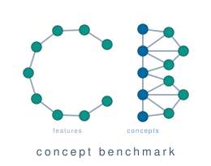

# Concept Benchmark

[](https://www.python.org)
[](https://opensource.org/licenses/MIT)

<p align="center">
  
</p>

**Concept Benchmark** is a Python package for benchmarking [concept bottleneck models](https://arxiv.org/abs/2007.04612) (CBMs). It provides synthetic datasets with ground-truth concept labels, allowing users to vary concept granularity, annotation quality, and the labeling rule, and measure how each factor affects model performance and the value of interventions. The package includes two benchmarks -- robot classification (decision support) and Sudoku validation (automation) -- across image, text, and tabular modalities.

## Table of Contents

1. [Installation](#installation)
2. [Quick Start](#quick-start)
3. [Benchmarks](#benchmarks)
4. [Citation](#citation)

## Installation

The package requires the **cairo** graphics library. Install it first:

```bash
# macOS
brew install cairo pkg-config

# Ubuntu / Debian
sudo apt-get install libcairo2-dev pkg-config python3-dev

# Fedora / RHEL
sudo dnf install cairo-devel pkg-config python3-devel
```

Then install the package:

```bash
pip install concept-benchmark
```

Or install from source:

```bash
git clone https://github.com/ustunb/concept-benchmark.git
cd concept-benchmark
uv sync
```

Verify the installation:

```bash
python3 -c "import concept_benchmark; print('OK')"
```

## Quick Start

A CBM predicts concepts from inputs (e.g., "has pointy feet"), then predicts the label from those concepts. At test time, a user can correct mispredicted concepts -- this is called an *intervention*. The package lets you measure whether correcting *k* concepts improves the label prediction, and how that depends on concept quality and annotation noise.

Each benchmark has a pipeline script in `scripts/` that runs the full experiment end-to-end:

```bash
# Robot classification (image, default 7 concepts)
PYTHONPATH=. python scripts/robot_pipeline.py --seed 1014

# Robot classification (subconcept variant, 12 concepts)
PYTHONPATH=. python scripts/robot_pipeline.py --seed 1014 --subconcept

# Sudoku validation
PYTHONPATH=. python scripts/sudoku_pipeline.py --seed 171

# Robot text classification
PYTHONPATH=. python scripts/robot_text_pipeline.py --seed 1337
```

Each script supports `--help` for the full list of flags. Use `--stages` to run a subset of the pipeline (e.g., `--stages cbm dnn intervene` to retrain models on existing data).

The pipeline scripts are also importable for programmatic use:

```python
import sys; sys.path.insert(0, "scripts")
import robot_pipeline as robot
from concept_benchmark.config import RobotBenchmarkConfig

cfg = RobotBenchmarkConfig(seed=1014)
data = robot.setup_dataset(cfg)
cbm = robot.train_cbm(cfg, data)
results = robot.run_interventions(cfg, cbm, data)
```


## Benchmarks

The package includes two benchmarks. **Robot classification** is a decision-support task where a human corrects the model's concept predictions to improve accuracy. **Sudoku validation** is an automation task where the system handles routine cases and defers uncertain ones to a human.

### Robot Classification

This benchmark targets decision-support settings where a human uses the model's concept predictions to improve their own decisions. The task is to predict the species of a fictional robot -- **Glorp** or **Drent** -- from its body features. Each robot has 9 binary features (mouth type, foot shape, knee presence, etc.). The default labeling rule is: Glorp if mouth is closed, foot is pointy, and robot has knees (all three); Drent otherwise. Which features matter and which are excluded (via `drop_concepts`) are configurable, mimicking real-world settings where the true relationship between features and labels is unknown. Available as image and text modalities.

<p align="center">
  
</p>

The following example uses the subconcept variant (12 concepts instead of the default 7) with intervention regimes:

```bash
# Run the full pipeline with subconcepts and expert interventions
PYTHONPATH=. python scripts/robot_pipeline.py --seed 1014 --subconcept --regimes baseline expert

# Run specific stages only (e.g., retrain and re-evaluate on existing data)
PYTHONPATH=. python scripts/robot_pipeline.py --seed 1014 --subconcept --stages cbm dnn intervene collect

# Test concept missingness (MCAR, 20% of labels masked)
PYTHONPATH=. python scripts/robot_pipeline.py --seed 1014 --subconcept --concept-missing 0.2
```

Expected results (subconcept, seed=1014, threshold=0.2):
```
CBM (k=0): 0.7812
 budget  accuracy
      0    0.7812
      1    0.9212
      3    0.9439
```

The most important parameters are listed below. For the full list, see `RobotBenchmarkConfig` in [`concept_benchmark/config.py`](concept_benchmark/config.py) or run `python scripts/robot_pipeline.py --help`.

| Parameter | Default | Description |
|-----------|---------|-------------|
| `drop_concepts` | `IDEAL_DROP` | Which concepts to exclude. Two presets are provided: `IDEAL_DROP` for 7 coarse concepts (binary foot_shape), `SUBCONCEPT_DROP` for 12 concepts (5 fine-grained foot subtypes). |
| `subconcept` | `False` | Shortcut that switches `drop_concepts` to `SUBCONCEPT_DROP`. |
| `model_features` | `{"mouth_type": "closed", "foot_shape": "pointy", "has_knees": "true"}` | Which feature values count toward the label score. |
| `model_weights` | `{"mouth_type": 5.0, "foot_shape": 8.0, "has_knees": -5.0}` | Concept weights for the labeling function. Score = `Σ w_i · 1[f_i = v_i] + intercept`. |
| `concept_missing` | `0.0` | Fraction of concept labels masked during training. |
| `regimes` | `["baseline"]` | How interventions are performed: `baseline` (oracle), `expert` (noisy human), `subjective` (noisy concept labels + noisy human), `machine`/`llm`/`clip` (concepts discovered via [Label-Free CBM](https://arxiv.org/abs/2304.06129)). |

<details>
<summary>Remaining parameters</summary>

| Parameter | Default | Description |
|-----------|---------|-------------|
| `seed` | `1014` / `1337` | Random seed (image / text) |
| `size` | `"medium"` | Image resolution: `"small"` (8px), `"medium"` (32px), `"large"` (600px). Image only. |
| `model_type` | `"stochastic"` | Labeling function: `"deterministic"` or `"stochastic"` |
| `concept_missing_mech` | `"none"` | Missingness mechanism: `"none"`, `"mcar"`, or `"mnar"` |
| `intervention_budgets` | `[1, 3]` | Number of concepts to correct per sample |
| `intervention_thresholds` | `[0.2, 0.4]` | Concepts whose predicted probability is within this distance of 0.5 are candidates for intervention |
| `intervention_strategy` | `"kflip"` | `"kflip"` (up to *k* concepts) or `"exact_k"` (exactly *k*) |
| `alignment_constraints` | `{}` | Sign constraints on concept weights (e.g., `{"has_knees": 1}`). Retrains the label predictor and re-evaluates interventions. |
| `difficulty` | `"hard"` | Corpus difficulty (text only) |
| `generic_rate` | `0.7` | Fraction of test set using concept-ambiguous text (text only) |

</details>

> **Note:** The `llm` and `clip` regimes call the Gemini API at intervention time. Set your key before running:
> ```bash
> export GEMINI_API_KEY=your_key_here
> ```

### Sudoku Validation

This benchmark targets automation settings where the system handles routine cases and defers uncertain ones to a human. The task is to determine whether a 9x9 Sudoku board is valid, i.e., contains the digits 1-9 exactly once in each row, column, and block. The 27 concepts correspond to the validity of each row, column, and 3x3 block. A board is valid if and only if all 27 concepts are true (AND structure), so a single violated concept is enough to invalidate the board. When the model abstains, a human can verify specific concepts (e.g., "is row 5 valid?") to resolve the uncertainty.

<p align="center">
  
</p>

The concept-supervised (CS) model -- the Sudoku equivalent of a CBM -- predicts 27 binary concepts, then a label predictor determines board validity. The selective classification stage finds a confidence threshold that achieves at least 95% accuracy on kept predictions.

```bash
# Run the full pipeline (generates boards, trains OCR + models, evaluates)
PYTHONPATH=. python scripts/sudoku_pipeline.py --seed 171

# Skip data regeneration (reuse existing boards), only retrain models
PYTHONPATH=. python scripts/sudoku_pipeline.py --seed 171 --stages cs dnn selective intervene align collect
```

Expected results (seed=171, target_accuracy=0.95):
```
model  selective_acc  selective_cov
  dnn          0.875           0.04
   cs          0.915           1.00
```

The most important parameters are listed below. For the full list, see `SudokuBenchmarkConfig` in [`concept_benchmark/config.py`](concept_benchmark/config.py) or run `python scripts/sudoku_pipeline.py --help`.

| Parameter | Default | Description |
|-----------|---------|-------------|
| `max_corrupt` | `9` | Number of cells corrupted in invalid boards (higher values produce subtler errors) |
| `data_type` | `"image"` | `"image"` evaluates on OCR-inferred digits (adds OCR stage); `"tabular"` evaluates on ground-truth digit values (no OCR). Training always uses ground-truth values. |
| `handwriting` | `True` | Render digits in handwritten style (only applies when `data_type="image"`) |
| `target_accuracy` | `0.9` | Minimum accuracy required on kept predictions |

<details>
<summary>Remaining parameters</summary>

| Parameter | Default | Description |
|-----------|---------|-------------|
| `seed` | `171` | Random seed |
| `n_samples` | `1000` | Number of boards to generate |
| `valid_ratio` | `0.5` | Fraction of valid boards |
| `intervention_thresholds` | `[0.2, 0.4, 0.6, 0.8]` | Concept confidence thresholds that determine which concepts are candidates for verification |

</details>

## Citation

If you use this package in your research, please cite:

```bibtex
@article{skirzynski2026concept,
  title={Measuring What Matters: Synthetic Benchmarks for Concept Bottleneck Models},
  author={Skirzy\'{n}ski, Julian and Cheon, Harry and Kadekodi, Shreyas and Stewart, Meredith and Ustun, Berk},
  year={2026},
}
```
