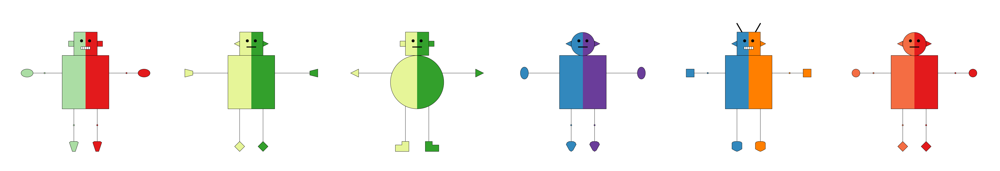
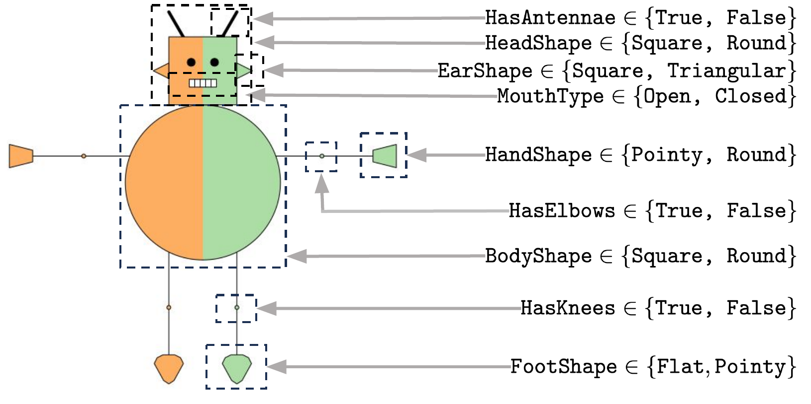
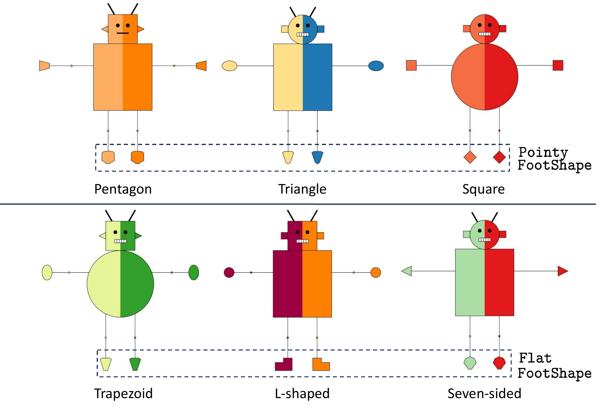
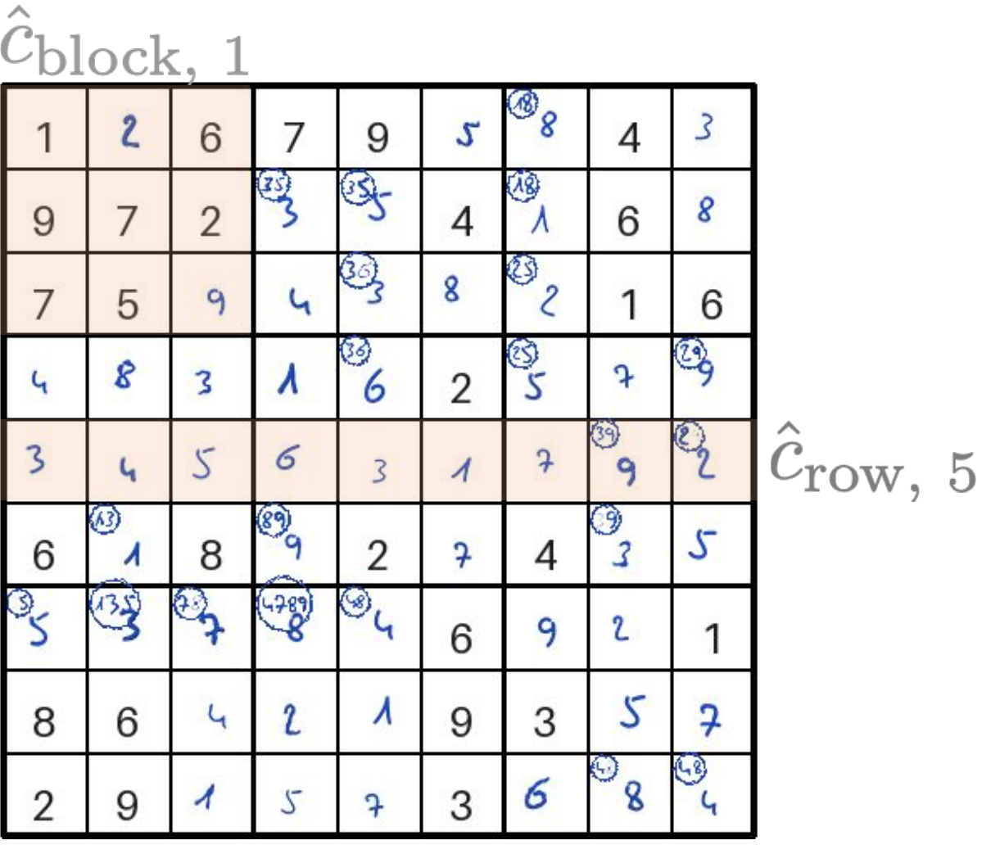

# Concept Benchmark

[](https://www.python.org)
[](https://opensource.org/licenses/MIT)

<p align="center">
  
</p>

**Concept Benchmark** is a Python package for benchmarking [concept bottleneck models](https://arxiv.org/abs/2007.04612) (CBMs). It provides synthetic datasets with ground-truth concept labels, letting researchers evaluate CBM pipelines end-to-end: from concept detection accuracy, to the effect of human interventions on model predictions, to whether learned concept-label relationships align with domain knowledge.

Evaluating CBMs on real-world data is difficult because ground-truth concept annotations are expensive, noisy, and often incomplete. Concept Benchmark addresses this by generating fully-labeled synthetic data where every concept value is known exactly. This makes it possible to measure intervention effectiveness, test robustness to missing or noisy concepts, and compare concept sets of different granularity -- all under controlled conditions where the ground truth is available.

The package ships with two benchmark domains (robot classification and sudoku validation) across three modalities (image, text, tabular). Each benchmark is configurable via a typed dataclass and can be run from the command line or the Python API. For more details, see [our paper](https://arxiv.org/abs/TODO).

## Table of Contents

1. [Installation](#installation)
2. [Quick Start](#quick-start)
3. [Benchmarks](#benchmarks)
4. [Configuration](#configuration)
5. [Creating Your Own Benchmark](#creating-your-own-benchmark)
6. [Citation](#citation)

## Installation

```bash
git clone https://github.com/ustunb/concept-benchmark.git
cd concept-benchmark
./install.sh
source venv/bin/activate
```

You can also install directly via pip:

```bash
pip install -e .
```

## Quick Start

The following example generates the robot classification dataset, trains a concept bottleneck model, and evaluates how human interventions on predicted concepts affect model accuracy:

```python
from concept_benchmark.benchmarks import robot
from concept_benchmark.config import RobotBenchmarkConfig

# Generate 30,720 robot images with ground-truth concept labels
cfg = RobotBenchmarkConfig(seed=1014)
data = robot.setup_dataset(cfg)

# Train a CBM: concept detector (image -> concepts) + frontend (concepts -> label)
cbm = robot.train_cbm(cfg, data)

# Evaluate k-flip interventions: correct the k most impactful concepts per sample
results = robot.run_interventions(cfg, cbm, data)
print(results[["budget", "accuracy"]].to_string(index=False))
```

Each benchmark is also available from the command line:

```bash
# Run the full robot pipeline (data generation, training, interventions, alignment)
cbm-benchmark robot --seed 1014

# Run the sudoku pipeline
cbm-benchmark sudoku --seed 171

# Run the robot text pipeline
cbm-benchmark robot-text --seed 1337
```

For fully-commented examples that walk through every configuration option, see [`scripts/demo_robot.py`](scripts/demo_robot.py), [`scripts/demo_sudoku.py`](scripts/demo_sudoku.py), and [`scripts/demo_robot_text.py`](scripts/demo_robot_text.py).

## Benchmarks

### Robot Classification

Classify synthetic robots into two species (**glorp** vs. **drent**) based on visual concepts. The label depends on three concepts (mouth type, foot shape, and knee presence), while other concepts like elbow shape and hand shape are spurious -- correlated with the label but not causally related.

<p align="center">
  
</p>

Each robot is defined by 9 visual concepts. The foot shape concept has 10 subtypes (5 pointy, 5 flat), which can be provided to the model at different levels of granularity to test how concept resolution affects performance:

<p align="center">
  
</p>

The robot benchmark supports three modalities. In **image** mode, robots are rendered as pixel images (32x32 or 600x600) using pycairo, with configurable color variations. In **text** mode, robots are described in natural language generated from a template corpus with deterministic synonym selection. Both modalities share the same concept structure and label rules.

| Parameter | Default | Description |
|-----------|---------|-------------|
| `seed` | `1014` | Random seed for reproducibility |
| `size` | `"medium"` | Image resolution: `"small"` (8px), `"medium"` (32px), `"large"` (600px) |
| `model_type` | `"stochastic"` | Label model: `"deterministic"` or `"stochastic"` |
| `subconcept` | `False` | Use fine-grained foot shape subtypes instead of binary pointy/flat |
| `concept_missing` | `0.0` | Fraction of concept labels to mask during training |
| `concept_missing_mech` | `"none"` | Missingness mechanism: `"none"`, `"mcar"`, or `"mnar"` |
| `intervention_budgets` | `[1, 3]` | Number of concepts to intervene on per sample |

The full list of parameters is documented in `RobotBenchmarkConfig` (see [`concept_benchmark/config.py`](concept_benchmark/config.py)).

### Sudoku Validation

Determine whether a 9x9 sudoku board is valid. The 27 concepts correspond to the validity of each row, column, and 3x3 block -- a board is valid if and only if all 27 concepts are true. This creates a naturally conjunctive relationship between concepts and the label, in contrast to the disjunctive structure of the robot benchmark.

<p align="center">
  
</p>

Boards can be represented as tabular data (81-cell integer vectors) or rendered as images with handwritten digits. The image pipeline includes an OCR stage that learns to read digits from rendered boards before passing them to the concept model.

| Parameter | Default | Description |
|-----------|---------|-------------|
| `seed` | `171` | Random seed for reproducibility |
| `n_samples` | `1000` | Number of boards to generate |
| `max_corrupt` | `9` | Maximum cells corrupted in invalid boards (higher = harder) |
| `valid_ratio` | `0.5` | Fraction of valid boards |
| `handwriting` | `True` | Render digits in handwritten style |
| `target_accuracy` | `0.9` | Target accuracy for selective classification |

The full list of parameters is documented in `SudokuBenchmarkConfig` (see [`concept_benchmark/config.py`](concept_benchmark/config.py)).

### Robot Text Classification

The same robot classification task, but from natural language descriptions instead of images. Text is generated from a JSONL template corpus with SHA-256 deterministic synonym selection, ensuring reproducibility. The test set can optionally mix in "generic" descriptions that are ambiguous about specific concepts, testing detector robustness on out-of-distribution text.

| Parameter | Default | Description |
|-----------|---------|-------------|
| `seed` | `1337` | Random seed for reproducibility |
| `difficulty` | `"hard"` | Corpus difficulty: controls template complexity |
| `generic_rate` | `0.7` | Fraction of test set using concept-ambiguous text |
| `concept_mode` | `"hard"` | Concept predictions: `"hard"` (binary) or `"soft"` (probabilities) |
| `dnn_model_name` | `"distilbert-base-uncased"` | HuggingFace model for the DNN baseline |
| `lfcbm_enable` | `False` | Also train a label-free CBM variant |

The full list of parameters is documented in `RobotTextBenchmarkConfig` (see [`concept_benchmark/config.py`](concept_benchmark/config.py)).

## Configuration

All experiment settings are managed through typed dataclasses in [`concept_benchmark/config.py`](concept_benchmark/config.py). Configs can be customized in Python, serialized to YAML for reproducibility, or passed via the CLI:

```python
from concept_benchmark.config import RobotBenchmarkConfig
from concept_benchmark.benchmarks import robot

# Customize any parameter
cfg = RobotBenchmarkConfig(seed=42, epochs=100, concept_missing=0.2, concept_missing_mech="mcar")
robot.run(cfg)

# Save and reload configs for reproducibility
cfg.to_yaml("my_experiment.yaml")
loaded = RobotBenchmarkConfig.from_yaml("my_experiment.yaml")
```

```bash
# Or pass a config file from the command line
cbm-benchmark robot --config my_experiment.yaml
```

## Creating Your Own Benchmark

To add a new benchmark domain, you need three components:

1. **A data generator** that produces a `ConceptDataset(X, C, y, meta)` -- features, binary concept labels, target labels, and metadata.
2. **A config dataclass** (like `RobotBenchmarkConfig`) to hold experiment settings.
3. **A benchmark module** (like `concept_benchmark/benchmarks/robot.py`) with stage functions.

The core data object is `ConceptDataset`:

```python
from concept_benchmark.data import ConceptDataset
import numpy as np

X = np.random.randn(1000, 10).astype(np.float32)       # features
C = (np.random.rand(1000, 3) > 0.5).astype(np.int8)    # binary concepts
y = (C[:, 0] & C[:, 1]).astype(np.int32)                # labels from concepts

data = ConceptDataset(X, C, y, meta={
    "concepts": ["has_feature_a", "has_feature_b", "has_feature_c"],
    "classes": ["negative", "positive"],
    "data_type": "tabular",
})

data.generate_cvindices(seed=0)
data.split("K05N01", fold_num_validation=4, fold_num_test=5)
```

Once your data is in a `ConceptDataset`, the existing training and intervention infrastructure (`ConceptDetector`, `FrontEndModel`, `ConceptInterventionRunner`) works out of the box. See the built-in benchmarks in `concept_benchmark/benchmarks/` as templates.

## Citation

If you use this package in your research, please cite:

```bibtex
@article{skirzynski2025concept,
  title={Measuring What Matters: Synthetic Benchmarks for Concept Bottleneck Models},
  author={Skirzy\'{n}ski, Julian and Cheon, Harry and Kadekodi, Shreyas and Stewart, Meredith and Ustun, Berk},
  year={2025},
}
```
