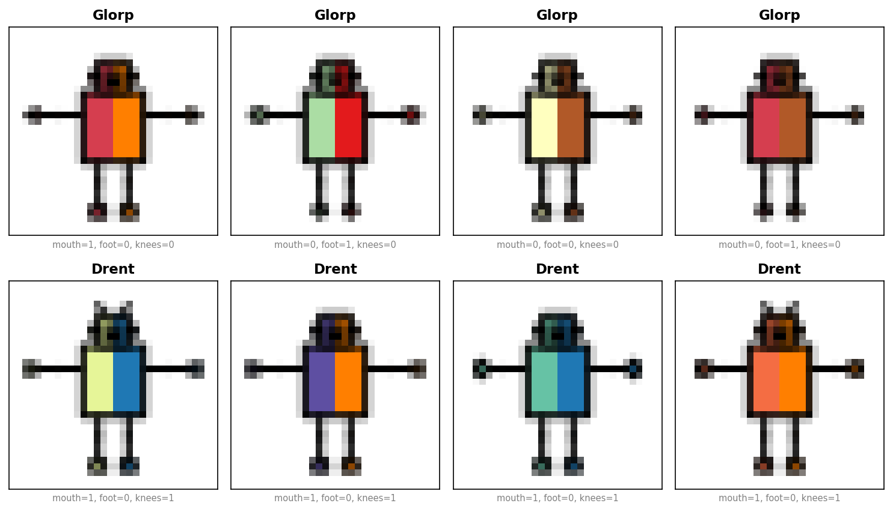
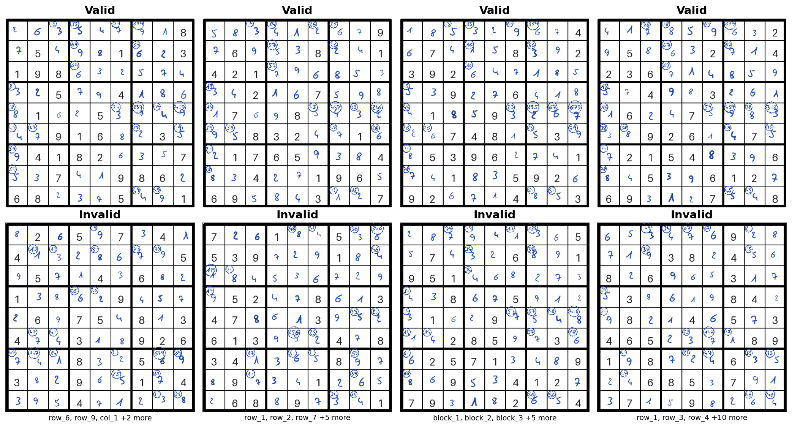

# Concept Benchmark

[](https://www.python.org)
[](https://opensource.org/licenses/MIT)

<p align="center">
  
</p>

**Concept Benchmark** is a Python package for generating synthetic datasets to benchmark [concept bottleneck models](https://arxiv.org/abs/2007.04612) (CBMs). It provides datasets with fully-specified ground-truth concept labels, letting you vary concept granularity, annotation quality, and the labeling rule — then measure exactly how each factor affects model performance and the value of interventions.

The package includes two benchmarks:

- **Robot Classification** — a decision-support task where a human corrects concept predictions to improve accuracy. Available as image and text modalities.
- **Sudoku Validation** — an automation task where the model handles routine cases and defers uncertain ones. Demonstrates selective classification and AND-fragility of concepts.

## Table of Contents

1. [Installation](#installation)
2. [Quick Start](#quick-start)
3. [Benchmark Your Own Model](#benchmark-your-own-model)
4. [Benchmarks](#benchmarks)
5. [Evaluation](#evaluation) (collapsible — interventions, alignment, custom strategies)
6. [Citation](#citation)

## Installation

The package requires the **cairo** graphics library. Install it first:

```bash
# macOS
brew install cairo pkg-config

# Ubuntu / Debian
sudo apt-get install libcairo2-dev pkg-config python3-dev

# Fedora / RHEL
sudo dnf install cairo-devel pkg-config python3-devel
```

Then install the package:

```bash
pip install concept-benchmark
```

Or install from source (includes training/evaluation code and pipeline scripts):

```bash
git clone https://github.com/ustunb/concept-benchmark.git
cd concept-benchmark
uv sync
```

> **Note:** `pip install concept-benchmark` gives you **dataset generation only** (`concept_benchmark/`). To run the full training/evaluation pipelines, clone the repo and use `uv sync` — this installs all dependencies including dev tools and pipeline scripts.

Verify the installation:

```bash
python3 -c "import concept_benchmark; print('OK')"
```

## Quick Start

A concept bottleneck model (CBM) first predicts interpretable *concepts* from inputs (e.g., "has pointy feet"), then uses those concepts to predict the final label. This two-stage design lets users inspect and correct the model's reasoning at test time — an operation called an *intervention*. This package gives you synthetic datasets where the ground-truth concepts are known, so you can measure exactly how much interventions help under different conditions.

### Robot Classification

The robot benchmark classifies fictional robots — **Glorps** vs. **Drents** — from their body features:

```python
from concept_benchmark import RobotDatasetGenerator

dataset = RobotDatasetGenerator(
    seed=1014,                # reproducibility
    subconcept=True,          # 12 fine-grained concepts (default: 7 coarse)
    model_type="stochastic",  # probabilistic labeling (or "deterministic")
    size="medium",            # image resolution: "small" (8px), "medium" (32px), "large" (600px)
    draw=True,                # render robot images (default) — set False to skip for quick exploration
).generate()

print(dataset.training.C.shape)   # (3800, 12) — concept annotations
print(dataset.training.concepts)
# ['head_shape', 'body_shape', 'has_knees', 'has_antennae', 'ears_shape',
#  'mouth_type', 'foot_shape_flat_trapezoid', 'foot_shape_flat_square',
#  'foot_shape_flat_5sided', 'foot_shape_pointy_rounded',
#  'foot_shape_pointy_square', 'foot_shape_pointy_4sided']
```

Inspect the data:

```python
dataset.training.to_dataframe().head(2)
#    head_shape  body_shape  has_knees  ...  foot_shape_pointy_4sided  label  class
# 0           0           0          0  ...                         0      1  glorp
# 1           0           0          0  ...                         1      1  glorp
```

For interactive browsing with [Renumics Spotlight](https://github.com/Renumics/spotlight) (`pip install concept-benchmark[explore]`):

```python
dataset.training.explore()  # opens in the browser
```

<p align="center">
  
</p>

Train a CBM — concept detector (images → concepts) and label predictor (concepts → label):

```python
import numpy as np
from concept_benchmark import RobotDatasetGenerator
from concept_benchmark.utils import set_deterministic_seed
from experiments.models import (
    ConceptDetector, FrontEndModel, ConceptBasedModel, RobotConceptClassifier,
)
from concept_benchmark.utils import determine_device, get_loader_config, patch_macos_dataloader

set_deterministic_seed(1014)
patch_macos_dataloader()
device = determine_device()
loader_config = get_loader_config(device)

dataset = RobotDatasetGenerator(seed=1014, subconcept=True, draw=True).generate()

# Step 1: train concept detector (images → concepts)
n_concepts = dataset.training.n_concepts
cd = ConceptDetector(model=RobotConceptClassifier(num_concepts=n_concepts, input_size=32))
cd.fit(dataset.training, dataset.validation,
       fit_params={"epochs": 50, "lr": 1e-3, "patience": 10, "device": str(device), **loader_config})

# Step 2: train label predictor (concepts → label)
fe = FrontEndModel()
fe.fit(dataset.training.C, dataset.training.y)

# Step 3: combine into a CBM and evaluate
cbm = ConceptBasedModel(concept_detector=cd, front_end_model=fe)
predictions = cbm.predict(dataset.test)
accuracy = np.mean(predictions == dataset.test.y)
print(f"CBM accuracy: {accuracy:.4f}")
# CBM accuracy: 0.7812
```

For a complete walkthrough including interventions and alignment, see `examples/robot_pipeline_example.py`.

### Sudoku Validation

The Sudoku benchmark determines whether a 9×9 board is valid. 27 concepts capture row, column, and block validity — a board is valid iff all 27 are true:

```python
from concept_benchmark import SudokuDatasetGenerator

dataset = SudokuDatasetGenerator(
    seed=171,             # reproducibility
    n_samples=1000,       # number of boards
    max_corrupt=9,        # cells swapped in invalid boards (higher = subtler errors)
    valid_ratio=0.5,      # fraction of valid boards
).generate()

print(dataset.training.C.shape)   # (600, 27) — 27 concept annotations
print(dataset.training.concepts)  # ['row_valid_1', 'row_valid_2', ..., 'block_valid_9']
```

Inspect the data:

```python
df = dataset.training.to_dataframe()
show_cols = list(dataset.training.concepts[:5]) + ["label"]
print(df[show_cols])
#      row_valid_1  row_valid_2  row_valid_3  row_valid_4  row_valid_5  label
# 0              1            1            1            1            1      1
# ..           ...          ...          ...          ...          ...    ...
# 301            1            0            0            1            1      0
```

<p align="center">
  
</p>

For a complete walkthrough including selective classification and interventions, see `examples/sudoku_quickstart.py`.

### Full Experiment Pipelines

To reproduce the paper results — including all intervention regimes, alignment constraints, and selective classification — use the pipeline scripts (requires cloning the repo):

```bash
python scripts/robot_pipeline.py --seed 1014 --subconcept   # see --help for all flags
python scripts/sudoku_pipeline.py --seed 171
```

## Benchmark Your Own Model

This guide shows how to evaluate your own concept bottleneck model on the benchmarks provided by this package. All examples below use the robot benchmark, but the same approach works for sudoku.

> **Prerequisite:** You need the full repository (not just `pip install concept-benchmark`) to run the pipeline scripts and examples.

### Getting data for your model

Generate a dataset and access it in the format your model expects:

```python
from concept_benchmark import RobotDatasetGenerator

dataset = RobotDatasetGenerator(seed=1014, subconcept=True, draw=True).generate()
train, val, test = dataset.training, dataset.validation, dataset.test
```

Each split is a `ConceptDatasetSample` with these attributes:

| Attribute | Type | Description |
|-----------|------|-------------|
| `X` | `np.ndarray` | Input features (images or tabular) |
| `C` | `np.ndarray` | Concept labels `(N, n_concepts)` |
| `y` | `np.ndarray` | Target labels `(N,)` |
| `concepts` | `list[str]` | Concept names |
| `n_concepts` | `int` | Number of concepts |
| `classes` | `list[str]` | Class names |
| `n` | `int` | Number of samples |

Access formats:

```python
# NumPy arrays (default)
X_train, C_train, y_train = train.X, train.C, train.y

# PyTorch DataLoader
loader = train.loader(batch_size=64, shuffle=True)
for x_batch, c_batch, y_batch in loader:
    ...

# Pandas DataFrame
df = train.to_dataframe()
```

### Wrapping your concept detector

The intervention runner requires a `ConceptDetector` subclass. Wrap your model:

```python
from experiments.models import ConceptDetector

class MyConceptDetector(ConceptDetector):
    def __init__(self, my_model):
        super().__init__()
        self._my_model = my_model

    def predict(self, dataset, **kwargs):
        """Must return (N, n_concepts) float array in [0, 1]."""
        return self._my_model.predict_concept_probs(dataset.X)
```

**Key point:** `predict()` receives a `ConceptDatasetSample`, not raw arrays. Access inputs via `dataset.X`.

#### Using a PyTorch module directly

If your model is already a PyTorch `nn.Module`, you can pass it directly instead of subclassing. Your module's `forward()` must:

- Accept a batched input tensor (e.g. `(B, 3, 32, 32)` for images)
- Return `(B, n_concepts)` **raw logits** (pre-sigmoid) — sigmoid is applied internally by `predict()`

The return value can also be a tuple (first element is used) or a dict with a `"logits"` key.

```python
cd = ConceptDetector(model=my_pytorch_module)
cd.fit(train, val, fit_params={"epochs": 50, "lr": 1e-3, "device": "cpu"})
```

You can also split your model into a backbone + concept head using the `embedding_model` parameter. The detector will probe the backbone's output shape and attach an MLP head automatically:

```python
cd = ConceptDetector(embedding_model=my_backbone)
cd.fit(train, val, fit_params={"epochs": 50, "lr": 1e-3, "device": "cpu"})
```

### Wrapping your label predictor

Subclass `FrontEndModel` and override `predict()` and `predict_proba()`:

```python
from experiments.models import FrontEndModel

class MyFrontEnd(FrontEndModel):
    def __init__(self, my_classifier):
        super().__init__()
        self._clf = my_classifier

    def predict(self, C):
        """C is (N, n_concepts) binary 0/1. Returns (N,) int labels."""
        return self._clf.predict(C)

    def predict_proba(self, C):
        """C is (N, n_concepts) binary 0/1. Returns (N, n_classes) probs."""
        return self._clf.predict_proba(C)
```

**Key point:** `C` is already binarized at 0.5 — binary 0/1 values, not probabilities.

For a simple logistic regression baseline, the built-in `FrontEndModel()` works out of the box:

```python
fe = FrontEndModel()
fe.fit(train.C, train.y)
```

### Assembling and evaluating

Combine your concept detector and label predictor into a `ConceptBasedModel`:

```python
from experiments.models import ConceptBasedModel

cbm = ConceptBasedModel(
    concept_detector=MyConceptDetector(my_concept_model),
    front_end_model=MyFrontEnd(my_classifier),
)

predictions = cbm.predict(test)
accuracy = np.mean(predictions == test.y)
print(f"CBM accuracy: {accuracy:.4f}")
```

For running interventions and alignment on your model, see the [Evaluation](#evaluation) section and [`examples/robot_pipeline_example.py`](examples/robot_pipeline_example.py).

## Benchmarks

### Robot Classification

This benchmark targets decision-support settings where a human uses the model's concept predictions to improve their own decisions. The task is to predict the species of a fictional robot — **Glorp** or **Drent** — from its body features. Each robot has 9 binary features (mouth type, foot shape, knee presence, etc.). The default labeling rule is: Glorp if mouth is closed, foot is pointy, and robot has knees (all three); Drent otherwise. The labeling function can be deterministic or stochastic (probabilistic), controlled via the `model_type` parameter. Which features matter and which are excluded (via `drop_concepts`) are configurable, mimicking real-world settings where the true relationship between features and labels is unknown. Available as image and text modalities.

<p align="center">
  
</p>

#### Parameters

All parameters can be passed to `RobotDatasetGenerator()` or as CLI flags to `robot_pipeline.py`:

```python
from concept_benchmark import RobotDatasetGenerator

dataset = RobotDatasetGenerator(
    seed=1014,                # random seed (default: 1014 for image, 1337 for text)
    data_type="image",        # "image" (render PNGs) or "text" (generate descriptions)
    subconcept=True,          # True: 12 fine-grained concepts; False: 7 coarse (default)
    model_type="stochastic",  # "stochastic" (probabilistic) or "deterministic" (threshold)
    model_scalar=4.2,         # sigmoid temperature for stochastic labeling
    size="medium",            # image resolution: "small" (8px), "medium" (32px), "large" (600px)
    color_mode="color",       # "color" or "grayscale" (image only)
    samples_per_instance=4,   # images per unique robot config (total = configs × this)
    concept_missing=0.0,      # fraction of concept labels masked during training
    concept_missing_mech="none",  # missingness mechanism: "none", "mcar", or "mnar"
    # label_formula: scoring rule for class assignment (see config.py for default)
    # drop_concepts: which features to exclude (preset via subconcept flag)
    # skew_specs: class-balance constraints for training data (see config.py)
    # --- text-only ---
    # difficulty="hard"       # corpus difficulty
    # generic_rate=0.7        # fraction of test set using concept-ambiguous text
).generate()
```

Run the full pipeline (interventions, alignment, regime comparisons) from the CLI:

```bash
python scripts/robot_pipeline.py --seed 1014 --subconcept                        # basic run
python scripts/robot_pipeline.py --seed 1014 --subconcept \
    --regimes baseline expert subjective machine                                  # intervention regimes
python scripts/robot_pipeline.py --seed 1014 --subconcept --concept-missing 0.2  # concept noise
python scripts/robot_pipeline.py --seed 1014 --subconcept --stages cbm dnn intervene  # specific stages
# run --help for all flags
```

> **Note:** The `llm` and `clip` regimes call the Gemini API at intervention time. Set `GEMINI_API_KEY` before running.

### Sudoku Validation

This benchmark targets automation settings where the system handles routine cases and defers uncertain ones to a human. The task is to determine whether a 9×9 Sudoku board is valid, i.e., contains the digits 1–9 exactly once in each row, column, and block. The 27 concepts correspond to the validity of each row, column, and 3×3 block. A board is valid if and only if all 27 concepts are true (AND structure), so a single violated concept is enough to invalidate the board. When the model abstains, a human can verify specific concepts (e.g., "is row 5 valid?") to resolve the uncertainty.

<p align="center">
  
</p>

#### Parameters

All parameters can be passed to `SudokuDatasetGenerator()` or as CLI flags to `sudoku_pipeline.py`:

```python
from concept_benchmark import SudokuDatasetGenerator

dataset = SudokuDatasetGenerator(
    seed=171,             # random seed
    n_samples=1000,       # number of boards to generate
    max_corrupt=9,        # cells swapped in invalid boards (higher = subtler errors)
    valid_ratio=0.5,      # fraction of valid boards
    data_type="image",    # "image" (OCR-inferred digits) or "tabular" (ground-truth values)
    handwriting=True,     # render digits in handwritten style (image only)
    target_accuracy=0.9,  # minimum accuracy on kept predictions (selective classification)
    # intervention_thresholds=[0.2, 0.4, 0.6, 0.8]  # concept confidence thresholds
).generate()
```

Run the full pipeline from the CLI:

```bash
python scripts/sudoku_pipeline.py --seed 171
python scripts/sudoku_pipeline.py --seed 171 --stages cs dnn selective intervene align collect  # skip data regen
# run --help for all flags
```

<details>
<summary><h2 style="display:inline">Evaluation</h2></summary>

### Interventions

Interventions are the core benefit of concept bottleneck models: at test time, a user (or automated system) can inspect and correct the model's concept predictions before the final label is determined.

#### Oracle interventions (manual approach)

The simplest way to run interventions is to directly manipulate concept predictions. After training a `ConceptDetector` and `FrontEndModel`, the workflow is:

1. Get concept probabilities from the detector
2. Identify the most uncertain concepts per sample
3. Replace them with ground-truth values
4. Re-predict with the label model

```python
import numpy as np
from experiments.models import ConceptDetector, FrontEndModel

# Assume cd and fe are already trained (see examples/robot_pipeline_example.py)

# Step 1: Get concept probabilities
# NOTE: cd.predict() returns probabilities in [0, 1], NOT binary predictions.
concept_probs = cd.predict(test)

# Step 2-3: For each sample, replace the k most uncertain concepts
# with ground-truth values
for k in [1, 3]:
    C_intervened = concept_probs.copy()
    uncertainty = np.abs(concept_probs - 0.5)  # distance from decision boundary
    for i in range(len(test)):
        most_uncertain = np.argsort(uncertainty[i])[:k]
        C_intervened[i, most_uncertain] = test.C[i, most_uncertain]

    # Step 4: Threshold to binary and predict
    C_binary = (C_intervened > 0.5).astype(np.float32)
    preds = fe.predict(C_binary)
    acc = np.mean(preds == test.y)
    print(f"k={k}: accuracy={acc:.4f}")
```

> **Important:** `ConceptDetector.predict()` returns **probabilities**, not binary predictions. This differs from the sklearn convention. To get binary predictions, threshold at 0.5: `binary = (cd.predict(dataset) > 0.5).astype(int)`.

> **Important:** `FrontEndModel.predict()` expects **binary** concept values (0/1), not probabilities. Always threshold before passing to the label predictor.

#### Using the intervention API

For more complex intervention scenarios (budgets, strategies, batched evaluation), use the `ConceptInterventionRunner`:

```python
import numpy as np
from experiments.models import ConceptBasedModel
from experiments.intervention import ConceptInterventionRunner, InterventionConfig
from experiments.kflip import KFlipInterventionStrategy

# Combine detector and label predictor into a CBM
cbm = ConceptBasedModel(concept_detector=cd, front_end_model=fe)

# Configure the intervention
config = InterventionConfig(
    max_concepts_per_instance=3,  # correct up to 3 concepts per sample
    score_threshold=0.2,          # only intervene on concepts with
                                  # probability within 0.2 of 0.5
)

# Run interventions
runner = ConceptInterventionRunner(model=cbm)
strategy = KFlipInterventionStrategy()
result = runner.run(strategy, config, test)

# InterventionResult contains y_prob_before/after and y_pred_after
acc_before = np.mean(np.argmax(result.y_prob_before, axis=1) == test.y)
acc_after = np.mean(result.y_pred_after == test.y)
print(f"Accuracy before: {acc_before:.4f}")
print(f"Accuracy after:  {acc_after:.4f}")
print(f"Concepts corrected: {result.mask.sum()}")
```

##### Key classes

- **`InterventionConfig`** — controls intervention budgets, thresholds, and per-instance caps
- **`KFlipInterventionStrategy`** — the default strategy: evaluates all subsets of up to *k* concepts per sample and selects the intervention that maximizes predicted confidence
- **`ConceptInterventionRunner`** — coordinates intervention execution and before/after evaluation

#### Writing a custom strategy

You can implement your own intervention strategy by subclassing `InterventionStrategy` and implementing the `propose()` method.

##### The intervention flow

When `ConceptInterventionRunner.run()` is called, it:

1. Builds an `InterventionBatch` from the dataset (concept predictions + ground truth)
2. Calls `strategy.propose(model, batch, config)` → returns a `StrategyProposal`
3. Applies the proposal's `mask` to replace predicted concepts with ground truth
4. Re-predicts labels with the corrected concepts
5. Returns an `InterventionResult` with before/after predictions

##### Key data classes

**`InterventionBatch`** — the input your strategy receives:

| Field | Type | Description |
|-------|------|-------------|
| `C_pred` | `(N, C) float` | Predicted concept probabilities |
| `C_true` | `(N, C) float` | Ground-truth concept values |
| `y_true` | `(N,) int` or `None` | True labels (optional) |
| `n_samples` | `int` | Number of samples |
| `n_concepts` | `int` | Number of concepts |

**`StrategyProposal`** — what your strategy returns:

| Field | Type | Description |
|-------|------|-------------|
| `mask` | `(N, C) bool` | `True` = replace prediction with ground truth |
| `ordering_used` | array or `None` | Concept order applied (optional) |
| `selected_instances` | array or `None` | Instance indices that received interventions |
| `details` | `dict` | Additional metadata |

##### Minimal example

Here's a strategy that intervenes on concepts closest to the 0.5 decision boundary:

```python
import numpy as np
from experiments.intervention import InterventionStrategy, StrategyProposal

class UncertaintyStrategy(InterventionStrategy):
    def __init__(self):
        super().__init__(name="uncertainty")

    def propose(self, model, batch, config):
        k = config.per_instance_limit(batch.n_concepts)
        mask = np.zeros((batch.n_samples, batch.n_concepts), dtype=bool)

        # Rank concepts by uncertainty (closeness to 0.5)
        uncertainty = 0.5 - np.abs(batch.C_pred - 0.5)
        for i in range(batch.n_samples):
            top_k = np.argsort(uncertainty[i])[-k:]
            mask[i, top_k] = True

        return StrategyProposal(mask=mask)
```

Use it with the runner:

```python
result = runner.run(
    strategy=UncertaintyStrategy(),
    config=InterventionConfig(max_concepts_per_instance=3, score_threshold=0.2),
    dataset=test,
)
```

##### The `prepare()` hook

Override `prepare()` if your strategy needs a validation pass before inference — for example, to precompute a global concept ordering:

```python
class MyStrategy(InterventionStrategy):
    def prepare(self, model, batch, config):
        """Called once on the validation set before run()."""
        # Compute concept importance from validation data
        self._state["concept_order"] = compute_importance(model, batch)

    def propose(self, model, batch, config):
        order = self._state["concept_order"]
        # ... use precomputed order
```

Call `runner.prepare()` before `runner.run()` to trigger the hook:

```python
runner.prepare(strategy, config, validation_dataset=val)
result = runner.run(strategy, config, dataset=test)
```

#### Intervention regimes

The package supports six intervention regimes that simulate different real-world annotation scenarios. Each regime varies the concept source (how concepts are predicted) and the intervention source (who corrects them):

| Regime | Concepts from | Corrected by | Description |
|--------|--------------|-------------|-------------|
| **baseline** | Ground truth | Ground truth | Perfect oracle — upper bound on intervention benefit |
| **expert** | Ground truth | Noisy human (80% acc) | Realistic human annotator |
| **subjective** | Noisy CBM (20% label noise) | Noisy human (80% acc) | Concepts trained on noisy labels |
| **machine** | LFCBM (GT descriptions) | Noisy human (80% acc) | Machine-discovered concepts |
| **llm** | LFCBM (LLM descriptions) | LLM (Gemini) | Fully automated with LLM |
| **clip** | LFCBM (CLIP keywords) | LLM (Gemini) | Fully automated with CLIP |

Run regimes via the pipeline script:

```bash
python scripts/robot_pipeline.py --seed 1014 --subconcept \
    --regimes baseline expert subjective machine
```

For a complete end-to-end example using `ConceptInterventionRunner` with training, interventions, and alignment, see [`examples/robot_pipeline_example.py`](examples/robot_pipeline_example.py).

### Alignment

Alignment constraints force the label predictor's concept weights to match a user's prior expectations about concept-label relationships. For example, if a domain expert knows that "has knees" should positively predict the Glorp class, alignment constrains that weight to be positive during retraining.

#### Why alignment matters

In standard CBM training, the label predictor (logistic regression on concept activations) learns weights freely from data. This can produce **counterintuitive** weights — e.g., `has_knees` getting a *negative* weight even when knees truly indicate Glorp — because the model exploits correlations among imperfect concept predictions.

The paper (Section 5.2) shows that alignment constraints:

- **Preserve** training accuracy — the aligned model performs comparably at k=0 (no interventions).
- **Destroy** intervention benefit — at k=3, the aligned subconcept model goes from +16% gain to -8% loss.

This happens because alignment forces the model into a weight configuration that is locally optimal for the training distribution but incompatible with ground-truth concept corrections at test time.

#### Usage

After training a `ConceptBasedModel`, use `run_alignment()` to retrain the frontend with sign constraints and compare:

```python
from experiments.utils import run_alignment

results = run_alignment(
    cbm=cbm,
    train_dataset=train,
    test_dataset=test,
    monotonicity_constraints={"has_knees": 1},  # force positive weight
)

print(f"Original accuracy: {results['original_accuracy']:.4f}")
print(f"Aligned accuracy:  {results['aligned_accuracy']:.4f}")
print(f"Accuracy change:   {results['accuracy_change']:+.4f}")
# Expected (seed=1014, subconcept): original 0.7812, aligned 0.7656 (-0.0156)
```

The `monotonicity_constraints` dict maps concept names to their required sign: `+1` for positive weight, `-1` for negative.

#### Expected results

| Setup | CBM (k=0) | Aligned (k=0) | CBM (k=3) gain | Aligned (k=3) gain |
|-------|-----------|----------------|-----------------|---------------------|
| ideal (7 concepts) | 0.8673 | 0.8657 | +10.2% | -0.4% |
| subconcept (12 concepts) | 0.7812 | 0.7656 | +6.9% | -8.0% |

For a complete end-to-end example with training, interventions, and alignment, see [`examples/robot_pipeline_example.py`](examples/robot_pipeline_example.py).

</details>

## Citation

If you use this package in your research, please cite:

```bibtex
@article{skirzynski2026concept,
  title={Measuring What Matters: Synthetic Benchmarks for Concept Bottleneck Models},
  author={Skirzy\'{n}ski, Julian and Cheon, Harry and Kadekodi, Shreyas and Stewart, Meredith and Ustun, Berk},
  year={2026},
}
```
